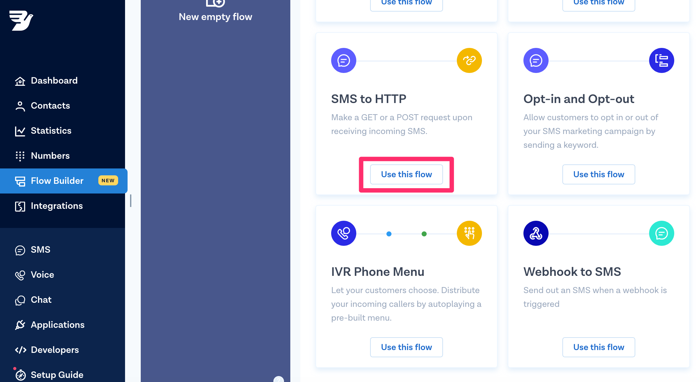
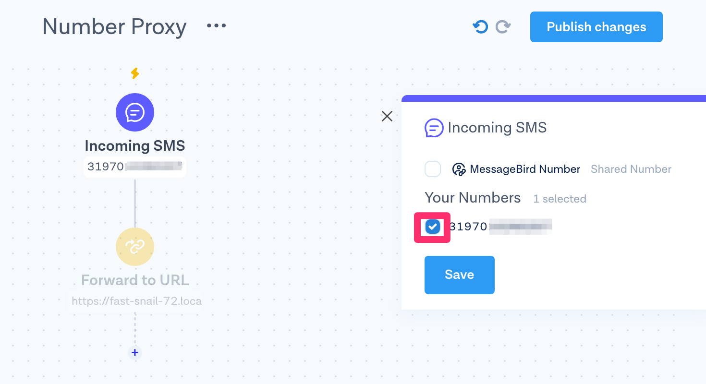
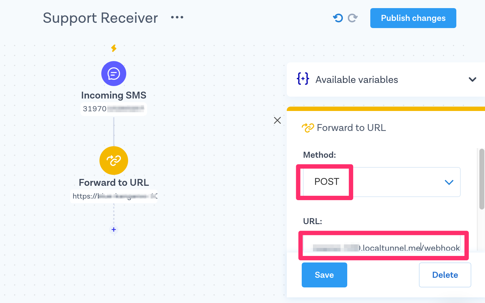
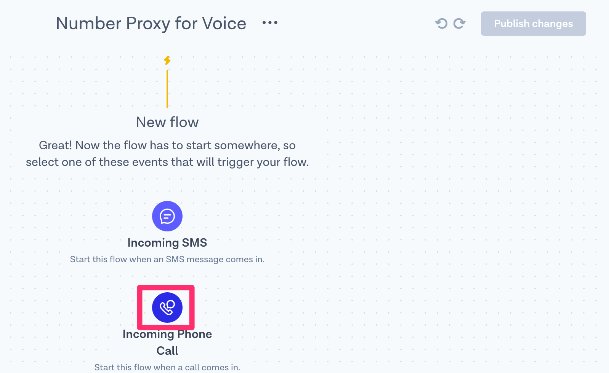
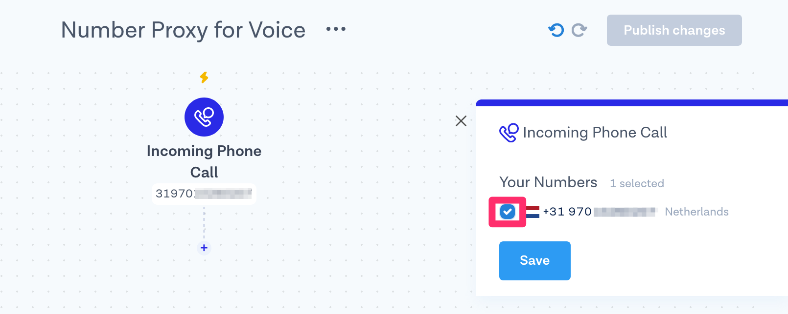
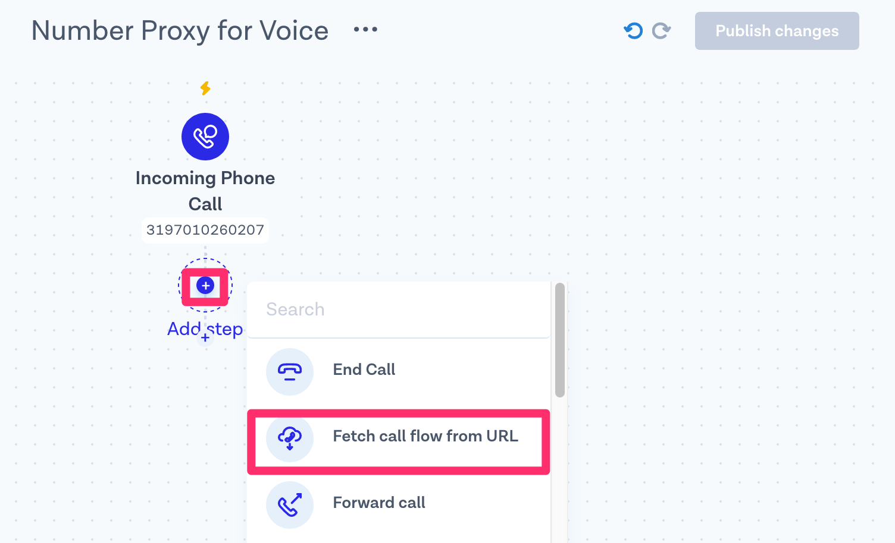
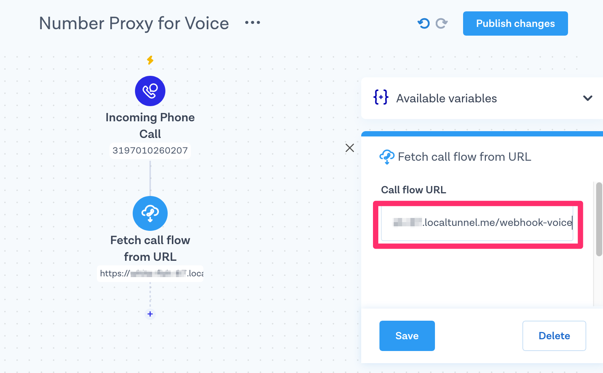

# Masked Phone Numbers
### ⏱ 30 min build time

No matter how seamless the user experience may be, the need for direct communication between two parties to complete a transaction can always arise. Online service platforms, such as ridesharing, online food delivery and logistics, facilitate the experience between customers and providers by matching both sides of the transaction to ensure everything runs smoothly and the transaction is completed. That is, everyone's happy :)

Sometimes, though, the experience doesn't quite go to plan and it becomes necessary for customers and providers to talk to or message each other directly.

The problem then arises that, for many reasons, both parties may not feel comfortable sharing their personal phone number.

A great solution to this issue is using anonymous proxy phone numbers that mask a user's personal phone number while also protecting the platform's personal contact details. The result, a customer doesn't see their provider's phone number but, instead, a number that belongs to the platform and forwards their call to the provider, and vice versa for providers as well.

In this guide, we'll show you a proxy system to mask phone numbers for a ficticious ridesharing platform, BirdCar, implemented in Node.js. BirdCar matches customers with drivers. The sample application includes a data model for customers, drivers, rides and proxy phone numbers and allows setting up new rides from an admin interface for demonstration purposes.

## Using a Number Pool

Before we dive into building the sample application, let's take a moment to explain the concept of a number pool. The idea is to set up a list of numbers by purchasing one or more [virtual mobile numbers](https://www.messagebird.com/numbers) from MessageBird and adding them to a database. Whenever a ride is created, the BirdCar application, that we're about to build, will automatically search the pool for one that is available and then assign it.

For simplicity and to allow testing with a single number, BirdCar assigns only one number to each ride, not one for each party. If the customer calls or texts this number, they get connected to the driver. And if the driver rings, the call or text is forwarded to the customer. The incoming caller or message sender identification sent from the network is used to determine which party calls and consequently find the other party's number.

Relying on the caller identification has the additional advantage that you do not have to purchase a new phone number for each transaction. Instead, it is possible to assign the same one to multiple transactions as long as different people are involved. The ride can be looked up based on who is calling. It is also possible to recycle numbers even for the same customer or driver, i.e., returning them to the pool, although we have not implemented this behavior in the sample code. In any case, the number should remain active for some time after a transaction has ended, just in case the driver and customer need to communicate afterwards, for example if the customer has forgotten an item in the driver’s car.

## Getting Started

BirdCar's sample application uses Node.js with the [Express](https://expressjs.com/) framework. It also uses a relational database to store the data model. We bundled [SQLite](https://www.npmjs.com/package/sqlite3) with the application so that you do not have to set up an RDBMS like MySQL, but if you extend the code for production use, you can still reuse the SQL queries with other databases.

First, let's make sure Node and npm are installed on your computer. If not, download both [from npmjs.com](https://www.npmjs.com/get-npm).

We've provided the source code [in a GitHub repository](https://github.com), so you can either clone the sample application with git or download a ZIP file with the code to your computer.

To install the [MessageBird SDK for NodeJS](https://www.npmjs.com/package/messagebird) and the other dependencies mentioned above, open a console pointed at the directory into which you've stored the sample application and run the following command:

````bash
npm install
````

## Prerequisites for Receiving Messages and Calls

### Overview

The BirdCar system receives incoming messages and calls and forwards them. From a high-level viewpoint, receiving with MessageBird is relatively simple: an application defines a _webhook URL_, which you assign to a number purchased on the MessageBird Dashboard using a flow. A [webhook](https://en.wikipedia.org/wiki/Webhook) is a URL on your site that doesn't render a page to users but is like an API endpoint that can be triggered by other servers. Every time someone sends a message to that number, MessageBird collects it and forwards it to the webhook URL, where you can process it.

### Exposing your Development Server with localtunnel

When working with webhooks, an external service like MessageBird needs to access your application, so the webhook URL must be public. During development, though, you're typically working in a local development environment that is not publicly available. Thankfully this is not a massive roadblock since various tools and services allow you to quickly expose your development environment to the Internet by providing a tunnel from a public URL to your local machine. One of these tools is [localtunnel.me](https://localtunnel.me), which is uniquely suited to NodeJS developers since you can comfortably install it using npm:

````bash
npm install -g localtunnel
````

You can start a tunnel by providing a local port number on which your application runs. Our application is configured to run on port 8080, so you can launch localtunnel with the following command:

````bash
lt --port 8080
````

After you've started the tunnel, localtunnel displays your temporary public URL. We'll need that in a minute.

If you're facing problems with localtunnel.me, you can have a look at other common tools such as [ngrok](https://ngrok.com), which works in virtually the same way.

### Getting an Inbound Number

A requirement for receiving messages and voice calls is a dedicated inbound number. Virtual mobile numbers look and work similar to regular mobile numbers, however, instead of being attached to a mobile device via a SIM card, they live in the cloud, i.e., a data center, and can process incoming SMS and voice calls. MessageBird offers numbers from different countries for a low monthly fee. Here's how to purchase one:

1. Go to the [Numbers](https://dashboard.messagebird.com/en/numbers) section of your MessageBird account and click **Buy a number**.
2. Choose the country in which you and your customers are located and make sure both the _SMS_ and _Voice_ capabilities are selected.
3. Choose one number from the selection and the duration for which you want to pay now. 
4. Confirm by clicking **Buy Number**.

Easy! You have set up your first virtual mobile number.

One is enough for testing, but for real usage of the masked number system, you'll need a larger pool of numbers. Follow the same steps listed above to purchase more.

### Connecting the Number to a Webhook for SMS

So you have a number now, but MessageBird has no idea what to do with it. That's why you need to define a _Flow_ next that ties your number to your webhook. We start with the flow for incoming SMS messages:

1. Go to the [Flow Builder](https://dashboard.messagebird.com/en/flow-builder) section of your MessageBird account. Under _Create a New Flow_, you'll see a list of templates. Find the one named "SMS to HTTP" and click "Use this flow". 
2. Give your flow a name, such as "Number Proxy for SMS".
3. The flow contains two steps. On the first step, the trigger "Incoming SMS", tick the box next to all the numbers dedicated to your number pool and **Save**. 
4. Click on the second step, "Forward to URL". Choose _POST_ as the method, copy the URL output from the `lt` command in the previous step and add `/webhook` to the end of it - this is the name of the route we use to handle incoming messages. Click **Save**. 
5. Click **Publish Changes** to activate your flow.

### Connecting the Number to a Webhook for Voice

You need to set up a second flow for the same number to process incoming calls as well:

1. Go back to the Flow Builder. Under _Create a New Flow_, click "New Flow".
2. Give your flow a name, such as "Number Proxy for Voice".
3. Choose "Incoming Phone Call" as the trigger. 
3. Configure the trigger step by ticking the boxes next to all the numbers dedicated to your number pool and clicking **Save**. 
4. Press the small **+** to add a new step to your flow and choose **Fetch call flow from URL**. 
5. Paste the same localtunnel base URL into the form, but this time append `/webhook-voice` to it - this is the name of the route we use to handle incoming calls in our sample application. Click **Save**. 
6. Hit **Publish Changes** and your flow becomes active!

## Configuring the MessageBird SDK

The MessageBird SDK and an API key are necessary to send (and forward) messages. The SDK is defined in `package.json` and loaded with a statement in `index.js`:

````javascript
// Load and initialize MesageBird SDK
var messagebird = require('messagebird')(process.env.MESSAGEBIRD_API_KEY);
````

You need to provide a MessageBird API key via an environment variable loaded with [dotenv](https://www.npmjs.com/package/dotenv). We've prepared an `env.example` file in the repository, which you should rename to `.env` and add the required information. Here's an example:

````env
MESSAGEBIRD_API_KEY=YOUR-API-KEY
````

You can create or retrieve a live API key from the [API access (REST) tab](https://dashboard.messagebird.com/en/developers/access) in the _Developers_ section of your MessageBird account.

## Creating our Data Model and Sample Data

Our BirdCar application uses a relational model. We have the following four entities:
- _Customers_, who have a name and a phone number.
- _Drivers_, who also have a name and a phone number.
- _Proxy Numbers_, which are the phone numbers in our pool.
- _Rides_, which have a start, destination, and date and time. Every ride references precisely one _Customer_, _Driver_, and _Proxy Number_ through the use of foreign keys.
Every entity has a database table with an auto-incremented numeric ID as its primary key.

Open the file `createdb.js` in the repository. It contains four CREATE TABLE queries to set up the data model. Below that, you'll find some INSERT INTO queries to add sample customers, drivers, and proxy numbers. Update those queries like this:
- Provide your name and mobile phone number as a customer.
- Provide another working phone number, such as a secondary phone or a friend's number, as a driver.
- Enter the virtual mobile number you purchased on the MessageBird dashboard. If you have more than one, copy the query code for each.

After updating the file, save it and run the following command (if you already have localtunnel running open a second command prompt for it):

````bash
node createdb.js
````

Note that this command only works once. If you make changes and want to recreate the database, you must delete the file `ridesharing.db` that the script creates before rerunning it:

````bash
rm ridesharing.db
node createdb.js
````

## The Admin Interface

The `app.get('/')` route in `index.js` and the associated HTML page in `views/admin.handlebars` implement a simple homepage that lists the content from the database and provides a form to add a new ride. For creating a ride, an admin can select a customer and driver from a drop-down, enter start, destination and date and time. The form submits this information to `/createride`.

## Creating a Ride

The `app.post('/')` route defined in `index.js` handles the following steps when creating a new ride:

### Getting Customer and Driver Information

The form fields contain only IDs for customer and driver, so we make a query for each to find all the information which we need in subsequent steps:

````javascript
// Create a new ride
app.post('/createride', function(req, res) {
    // Find customer details
    db.get("SELECT * FROM customers WHERE id = $id", { $id : req.body.customer }, function(err, row) {
        var customer = row;

        // Find driver details
        db.get("SELECT * FROM drivers WHERE id = $id", { $id : req.body.driver }, function(err, row) {
            var driver = row;
`````

### Finding a Number

We need to get a number from the pool that was never assigned to a ride for the customer or the driver. To check this, we write a SQL query with two subqueries:
- Find all numbers for rides from the selected customer (subquery 1)
- Find all numbers for rides from the selected driver (subquery 2)
- Find all numbers that are in neither of those lists and return one of them (main query)

In Javascript and SQL, this check looks like this:

````javascript
// Find a number that has not been used by the driver or the customer
db.get("SELECT * FROM proxy_numbers "
    + "WHERE id NOT IN (SELECT number_id FROM rides WHERE customer_id = $customer) "
    + "AND id NOT IN (SELECT number_id FROM rides WHERE driver_id = $driver)", {
        $customer : customer.id,
        $driver : driver.id,
}, function(err, row) {
````

It's possible that no row was found. In that case, we alert the admin that the number pool is depleted and they should buy more numbers:

````javascript
if (row == null) {
    // No number found!
    res.send("No number available! Please extend your pool.");
````

### Storing the Ride

If a number was found, i.e., our query returned a row, we insert a new ride into the database using the information from the form:

````javascript
} else {
var proxyNumber = row;

// Store ride in database
db.run("INSERT INTO rides (start, destination, datetime, customer_id, driver_id, number_id) VALUES ($start, $destination, $datetime, $customer, $driver,$number)", {
    $start : req.body.start,
    $destination : req.body.destination,
    $datetime : req.body.datetime,
    $customer : customer.id,
    $driver : driver.id,
    $number : proxyNumber.id
});
````

### Notifying Customer and Driver

We send a message to both the customer and the driver to confirm the ride. This message should originate from the proxy number, so they can quickly reply to this message to reach the other party. For sending messages, the MessageBird SDK provides the `messagebird.message.create()` function. We need to call the function twice because we're sending two different versions of the message:

````javascript
// Notify the customer
messagebird.messages.create({
    originator : proxyNumber.number,
    recipients : [ customer.number ],
    body : driver.name + " will pick you up at " + req.body.datetime + ". Reply to this message to contact the driver."
}, function(err, response) {
    console.log(err, response);
});

// Notify the driver
messagebird.messages.create({
    originator : proxyNumber.number,
    recipients : [ driver.number ],
    body : customer.name + " will wait for you at " + req.body.datetime + ". Reply to this message to contact the customer."
}, function(err, response) {
    console.log(err, response);
});
````

The response, or error, if any, is logged to the console, but we do not read or take any action based on them. In production applications, you should definitely check if the messages were sent successfully.

## Receiving and Forwarding Messages

When a customer or driver replies to the message confirming their ride, the response should go to the other party. As we have instructed MessageBird to post to `/webhook` we need to implement the `app.post('/webhook');` route.

First, we read the input sent from MessageBird. We're interested in three fields: originator, payload (i.e., the message text) and recipient (the virtual number to which the user sent their message), so that we can find the ride based on this information:

````javascript
// Handle incoming messages
app.post('/webhook', function(req, res) {
    // Read input sent from MessageBird
    var number = req.body.originator;
    var text = req.body.payload;
    var proxy = req.body.recipient;
````

### Looking up Receiver

To find the ride, we use an SQL query which joins all four tables. We're interested in all entries in which the proxy number matches the `recipient` field from the webhook and the `originator` matches _either_ the driver's number _or_ the customer's number:

````javascript
db.get("SELECT c.number AS customer_number, d.number AS driver_number, p.number AS proxy_number "
    + "FROM rides r JOIN customers c ON r.customer_id = c.id JOIN drivers d ON r.driver_id = d.id JOIN proxy_numbers p ON p.id = r.number_id "
    + "WHERE proxy_number = $proxy AND (driver_number = $number OR customer_number = $number)", {
        $number : number,
        $proxy : proxy
    }, function(err, row) {
````

After we've found the ride based on an _or_-condition, we need to check again which party was the actual sender and determine the recipient, i.e., the other party, from there:

````javascript
if (row) {
    // Got a match!
    // Need to find out whether customer or driver sent this and forward to the other side
    var recipient = "";
    if (number == row.customer_number)
        recipient = row.driver_number;
    else
    if (number == row.driver_number)
        recipient = row.customer_number;                
````

### Forwarding Message

We use `messagebird.messages.create()` to forward the message. The proxy number is used as the originator, and we send the original text to the recipient as determined above:

````javascript
// Forward the message through the MessageBird API
messagebird.messages.create({
    originator : proxy,
    recipients : [ recipient ],
    body : text
}, function(err, response) {
    console.log(err, response);
});
````

If we don't find a ride, we log an error to the console:

````javascript
} else {
    // Cannot match numbers
    console.log("Could not find a ride for customer/driver " + number + " that uses proxy " + proxy + ".");
}
````

## Receiving and Forwarding Voice Calls

When a customer or driver calls the proxy number from which they received the confirmation, the system should transfer the call to the other party. As we have instructed MessageBird to fetch instructions from `/webhook-voice` we need to implement the `app.get('/webhook-voice');` route. Note that unlike the SMS webhook, where we have configured POST, custom call flows are always retrieved with GET.

First, we read the input sent from MessageBird. We're interested in the source and destination of the call so that we can find the ride based on this information:

````javascript
// Handle incoming calls
app.get('/webhook-voice', function(req, res) {
    // Read input sent from MessageBird
    var number = req.query.source;
    var proxy = req.query.destination;
````

As we will return a new call flow encoded in XML format, we set the response header accordingly:

````javascript
    // Answer will always be XML
    res.set('Content-Type', 'application/xml');
````

### Looking up Receiver

This works exactly as described for the SMS webhooks, hence the SQL query and surrounding Javascript code is mostly a verbatim copy. If you are extending the sample to build a production application it could be a good idea to make a function as an abstraction around it to avoid duplicate code.

### Transferring call

To transfer the call, we return a short snippet of XML to MessageBird, and also log the action to the console:

````javascript
// Create call flow to instruct transfer
console.log("Transferring call to " + recipient);
res.send('<?xml version="1.0" encoding="UTF-8"?>'
    + '<Transfer destination="' + recipient + '" mask="true" />');
````

The `<Transfer />` element takes two attributes: _destination_ indicates the number to transfer the call to, which we've determined as described above, and _mask_ instructs MessageBird to use the proxy number instead of the original caller ID.

If we don't find a ride, we return a different XML snippet with a `<Say />` element, which is used to read some instructions to the caller:

````javascript
} else {
    // Cannot match numbers
    res.send('<?xml version="1.0" encoding="UTF-8"?>'
        + '<Say language="en-GB" voice="female">Sorry, we cannot identify your transaction. Make sure you call in from the number you registered.</Say>');
}
````

This element takes two attributes, _language_ and _voice_, that define the configuration for speech synthesis. The text itself goes between the opening and closing XML element.

## Testing the Application

Check again that you have set up at least one number correctly with two flows to forward both incoming messages and incoming phone calls to a localtunnel URL and that the tunnel is still running. Remember, whenever you start a fresh tunnel, you'll get a new URL, so you have to update the flows accordingly. You can also configure a more permanent URL using the `-s` attribute with the `lt` command.

To start the application you have to enter another command, but your existing console window is already busy running your tunnel. Therefore you need to open another one. On a Mac you can press _Command_ + _Tab_ to open a second tab that's already pointed to the correct directory. With other operating systems you may have to resort to open another console window manually. Either way, once you've got a command prompt, type the following to start the application:

````bash
node index.js
````

Open http://localhost:8080/ in your browser and create a ride between the customer and driver you configured in `dbcreate.js`. If everything worked out correctly, two phones should receive a message. Reply to the incoming message on one phone and you'll receive this reply on the other phone, but magically coming from the proxy number. Wow!

If you didn't get the messages or the forwarding doesn't work, check the console output from Node to see if there's any problem with the API, such as an incorrect API key or a typo in one of the numbers, and try again.

You can then test voice call forwarding as well: call the proxy number from one phone and magically see the other phone ring.

## Nice work!

You've just built your own number masking system with MessageBird! 

You can now use the flow, code snippets and UI examples from this tutorial as an inspiration to build your own custom notification system.

Running into issues? Explore the [complete code on GitHub](https://github.com) to see whether you might have missed something. 

## Next steps

Want to build something similar but not quite sure how to get started? Please feel free to let us know at support@messagebird.com, we'd love to help!


